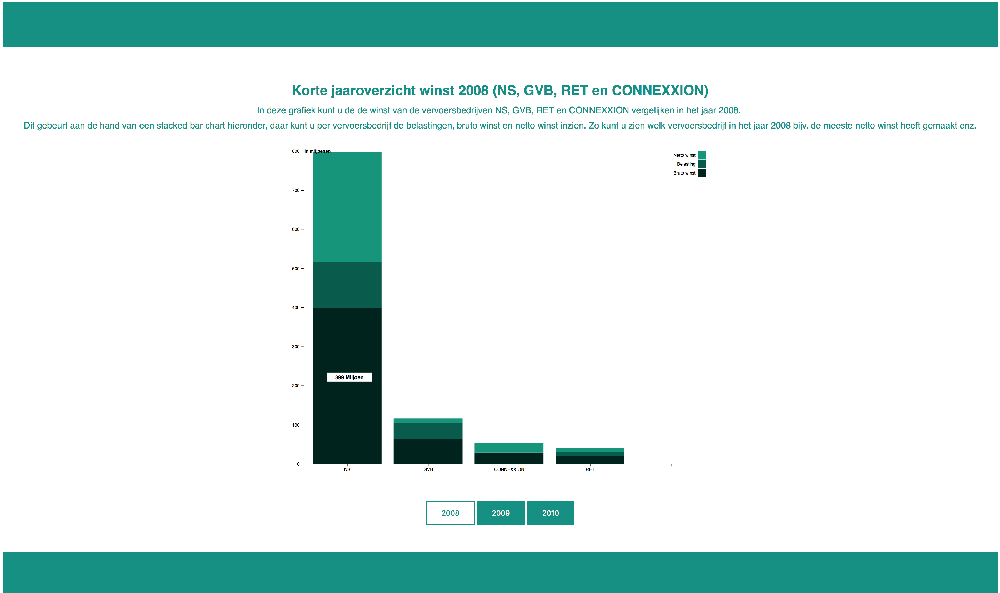

# Opdracht A project information design individueel

## Wat is de opdracht

Voor opdracht A voor het project Information Design, moest er een datavisualisatie gemaakt worden waaruit de gebruiker 3 verschillende inzichten kan halen zoals wie, waar, wanneer, hoe, wat, wie, waarom enz.
Uit deze datavisualisatie kan de gebruiker conclusies trekken door verschillende inzichten met elkaar te vergelijken.
De visualisatie voor opdracht A is geprogrammeerd in D3.

## Proces

Als eerst wou ik mijn eigen dataset voor research of data gebruiken voor opdracht A. Dit was data over winst die vervoersbedrijven extra verdienen aan reizigers die uitchecken en zo hun instaptarief verliezen. Dit wou ik vergelijken tegenover de totale winst van de vervoersbedrijf zodat reizigers helder konden krijgen hoeveel geld er eigenlijk nou intotaal verloren wordt.
Echter kwam ik erachter na mijn 2de coach gesprek dat dit niet echt voldeed aan de eisen van opdracht A (namelijk 3 inzichten) en dat de data die ik had eigenlijk te weinig was, omdat deze voornamelijk komen van nieuwsartikelen en onderzoeken waar conclusies uit worden getrokken (in het geval van het verloren instaptarief).

Hiermee ben ik dus verder gaan zoeken naar een nieuwe dataset en kwam ik uit bij jaarverslagen van de volgende vervoersbedrijven: NS, GVB, Connexxion en RET.
Uit deze jaarverslagen heb ik een volldig overzicht kunnen bemachtigen van o.a de opbrengsten, bruto winst, netto winst, bedrijflasten, belastingen, winst voor belastingen, kosten van personeel en meer van de eerder genoemde vervoersbedrijven (deze bronnen kunt u onder de kopje bronnen vinden als links).

Nadat ik deze data had opgeslagen ben ik gaan nadenken wat ik hiermee wou vertellen. Hiermee ben ik uitgekomen dat ik van de verschillende vervoersbedrijven de opbrengsten, bruto winst, netto winst en de belastingen wou laten inzien op een stacked barchart (daarvoor heb ik ook nagedacht om dit te doen op een normale barchart of grouped barchart, maar ik heb gekozen voor een stacked barchart omdat dit mij overzichtelijker leek om in te zien met de data die ik wil laten zien). 
Hiermee ziet de gebruiker 4 verschillende inzichten namelijk de opbrengsten, bruto winst, netto winst en de belastingen en kan hij/zij dit vergelijken tussen 4 verschillende vervoersbedrijven in Nederland en zo dus zien wie bijv. het meeste netto winst heeft gemaakt, het meeste bruto winst, de opbrengsten intotaal van de vervoersbedrijven of juist wie het meeste winst moet inleveren bij de belasting. Dit wou ik doen voor 3 jaren namelijk 2008, 2009 en 2010 waarbij er dus intotaal 3 verschillende grafieken komen.

Echter kwam ik erachter dat er een probleem ontstond met een inzicht tijdens het maken van de grafiek. Dat is namelijk dat de opbrengsten van NS vaak in de miljarden zitten, waarbij de opbrengsten van de andere vervoersbedrijven vaak in de miljoenen zijn. Hierdoor kon je op de stacked barchart nauwlijks meer zien wat bijv. de opbrengsten, netto winst, bruto winst en belastingen waren van de andere vervoersbedrijven. 
Door op deze probleem aan te lopen kon ik eigenlijk ook wel al een conclusie trekken dat NS de grootste vervoersbedrijf is in Nederland wat blijkt uit het verschil van de grafiek aan de hand van de cijfers.

Ik heb dus besloten om de opbrengsten buiten beschouwing te laten en verder te gaan met de inzichten bruto winst, netto winst en belastingen. Hiermee heeft de gebruiker dus nog steeds 3 inzichten hij/zij kan zien wat de bruto winst was van de vervoersbedrijf, de belasting die ingeleverd moest worden over de bruto winst en hiermee dus ook de netto winst uiteindelijk maakt wat daarmee ook gelijk de totale winst is van een vervoersbedrijf van dat desbetreffende jaar.

Nadat ik alles op een rijtje had hoe ik het ongeveer wou doen en laten zien ben ik begonnen om code te schrijven.
Hiervoor heb ik eerst een intro & uitleg page geschreven genaamd `index.html & uitleg.html`. Hier staat o.a een openingszin om de aandacht te trekken van de gebruiker om hem verder te laten gaan met het proces. Vervolgens komt hij op de uitleg page hierop wordt uitgelegd wat je zowel kan doen qua interactie en hoe je de grafiek kan lezen.
Deze intro & uitleg page heb ik zelf gestyled in de `styleindex.css & uitlegstyle.css`

Daarna ben ik mijn data gaan schrijven in een CSV file.
De data die ik namelijk heb gevonden komen van jaarverslagen die vaak een pdf versie of online reader versie zijn.
Hierin zaten de jaaroverzichten met alle winst en lasten van vervoersbedrijven.
Dit is dus geen standaard CSV of TSV file wat je krijgt bij bijv. het CBS.
Hierdoor moest ik zelf de data (cijfers) overtypen in een CSV file. Dit heb ik gedaan in Brackets en heb dus ook geen data moeten cleanen via javascript.
Deze data heb ik in 3 bestanden opgedeeld namelijk de 3 jaren die ik wil laten zien op 3 verschillende grafieken.
Deze CSV bestanden heten `data2008.csv, data2009.csv, data2010.csv`

Naast deze data heb ik ook 3 verschillende html files gemaakt waar de grafieken worden ingeladen namelijk `2008.html, 2009.html, 2010.html` Ook deze html bestanden heb ik zelf geschreven en gestyled met de `style.css`

Hierna ben ik opzoek gegaan naar een stacked barchart waarbij gebruik wordt gemaakt van D3.
Daarbij ben ik uitgekomen op de stacked barchart van `Mike Foster 24 Maart 2017 https://bl.ocks.org/mjfoster83/7c9bdfd714ab2f2e39dd5c09057a55a0`
Hierbij heb ik een paar aanpassingen gedaan zodat deze stacked barchart werkt op mijn data en overeenkomt met mijn huisstijl deze kunt u vinden onder het kopje aanpassingen.

## Aanpassingen

### script2008.js, script2009.js, script 2010.js
* Mike Forster Stacked Bar Chart March 24, 2017 (https://bl.ocks.org/mjfoster83/7c9bdfd714ab2f2e39dd5c09057a55a0)

* De code stond eerst in 1 html deze heb ik opgedeels in een css, html en js bestand en aan elkaar gelinked zodat alles weer werkend was.


* De witruimte tussen de X-as en grafiek heb ik veranderd van 0 naar 20 (rangeRound) en de witruimte tussen grafieken .paddingInner heb ik veranderd van 0.05 naar 0.15 zodat de grafieken tussen de bars als op de X-as niet teveel op elkaar komen te staan.

Eerst:
``` javascript
var x = d3.scaleBand()
.rangeRound([0, width])
.paddingInner(0.05)
```

Aangepast:
``` javascript
var x = d3.scaleBand()
.rangeRound([20, width])
.paddingInner(0.15) 
```


* Hier heb ik de orginele kleuren van Mike Forsters stacked barchart veranderd naar kleuren die meer passen bij mijn huisstijl. Dit heb ik gedaan aan de hand van hexcodes.

Eerst: 
``` javascript
var z = d3.scaleOrdinal()
.range(["#98abc5", "#8a89a6", "#7b6888", "#6b486b", "#a05d56", "#d0743c", "#ff8c00"]);
```

Aangepast: 
``` javascript
var z = d3.scaleOrdinal()
.range(["#00231E", "#005B4C", "#02967A", "#02C49F", "#00FFCE"]);
```


* De benaming van de csv file heb ik aangepast naar de naam van mijn eigen csv files zodat D3 de juiste data aanroept. Dit kunnen bij mij 3 verschillende csv files zijn zoals data2008.csv, data2009.csv, data2010.csv

Eerst: 
``` javascript
d3.csv("age-groups.csv", function(d, i, columns)
```
Aangepast:
``` javascript
d3.csv("data/data2008.csv", function (d, i, columns)
```


* Bij de tooltip heb ik naast de cijfers die erin komen miljoenen erin bijgevoegd zodat als er gehoverd wordt over de bar er (xxxcijfer) miljoen staat inplaats van alleen (xxxcijfer)

Eerst: 
``` javascript
.on("mousemove", function(d) {
console.log(d);
var xPosition = d3.mouse(this)[0] - 5;
var yPosition = d3.mouse(this)[1] - 5;
tooltip.attr("transform", "translate(" + xPosition + "," + yPosition + ")");
tooltip.select("text").text(d[1]-d[0]);
});
```

Aangepast: 
``` javascript
.on("mousemove", function (d) {
console.log(d);
var xPosition = d3.mouse(this)[0] - 5;
var yPosition = d3.mouse(this)[1] - 5;
tooltip.attr("transform", "translate(" + xPosition + "," + yPosition + ")");
tooltip.select("text").text(d[1] - d[0] + " Miljoen") ;
});
```


* Transition toegevoegd zodat de tekst van de Y-as langzaam naar beneden komt. (dit wou ik eerst doen met de bars maar ik kreeg dit niet werkend.)

Eerst: 
``` javascript
g.append("g")
.attr("class", "axis")
.attr("transform", "translate(0," + height + ")")
.call(d3.axisBottom(x));
```

Aangepast:
``` javascript
g.append("g")
.attr("class", "axis")
.transition().duration(3000)
.attr("transform", "translate(0," + height + ")")
.call(d3.axisBottom(x));
```


* Op de X-as heb ik tekst toegevoegd in miljoenen zodat het duidelijk is dat het om miljoenen gaat met de cijfers op de x-as daarnaast heb ik ook aangegeven dat de fill voor deze tekst black moet zijn.

Eerst: 
``` javascript
g.append("g")
.attr("class", "axis")
.call(d3.axisLeft(y).ticks(null, "s"))
.append("text")
.attr("x", 2)
.attr("y", y(y.ticks().pop()) + 0.5)
 .attr("dy", "0.32em")
 .attr("fill", "#000")
 .attr("font-weight", "bold")
 .attr("text-anchor", "start");
```

Aangepast:
``` javascript
g.append("g")
.attr("class", "axis")
.call(d3.axisLeft(y).ticks(null, "s"))
.append("text")
.attr("x", 2)
.attr("y", y(y.ticks().pop()) + 0.5)
.attr("dy", "0.32em")
.attr("fill", "#000")
.attr("font-weight", "bold")
.attr("text-anchor", "start")
.attr("fill", "black")
.text("in miljoenen")
;
```


* De breedte van de tooltip heb ik veranderd van 60 naar 100 zodat de box van de tooltip wat breder is ik vond deze te smal.

Eerst: 
``` javascript
tooltip.append("rect")
.attr("width", 60)
```

Aangepast:
``` javascript
tooltip.append("rect")
.attr("width", 100)
```


* De afstand van de tekst in de tooltip box heb ik veranderd van 30 naar 50 zodat het weer in het midden uitlijnd.

Eerst: 
``` javascript
tooltip.append("text")
.attr("x", 30)
```

Aangepast:
``` javascript
tooltip.append("text")
.attr("x", 50)
```


### 2008.html, 2009.html, 2010.html, index.html, uitleg.html, style.css, styleindex.css, uitleg,style.css
* Zelf geschreven en gestyled

### data.2008.csv, data2009.csv, data2010.csv
* Deze heb ik met de hand geschreven via brackets en gelinked in je javascript.

## Data

Stacked barchart code van Mike Froster
https://bl.ocks.org/mjfoster83/7c9bdfd714ab2f2e39dd5c09057a55a0

De data die ik heb gebruikt van de vervoersbedrijven komen van de volgende links:
* NS
http://www.nsstations.nl/binaries/content/assets/documenten/jaarverslag-2009.pdf
http://2015.nsjaarverslag.nl/FbContent.ashx/pub_1000/downloads/NS_Jaarverslag2011.pdf

* GVB
https://assets.gvb.nl/2013/#p=8
http://fliphtml5.com/ikoj/bnxd/basic

* Connexxion
https://www.transdev.nl/data/upload/cnxx_jv_2009_nl_10v.pdf
https://www.transdev.nl/data/upload/CNXX_JV_2010_NL_dec.pdf

* RET
https://www.google.nl/url?sa=t&rct=j&q=&esrc=s&source=web&cd=1&ved=0ahUKEwjd5KKipa3XAhUH5aQKHaavDwYQFggnMAA&url=http%3A%2F%2Fcorporate.ret.nl%2Fen%2Ffinances%2Fannual-reports%2Fannual-report-2010-dutch.html&usg=AOvVaw2_V9cTSANA_qIu2mmRMjn1
https://www.google.nl/url?sa=t&rct=j&q=&esrc=s&source=web&cd=1&ved=0ahUKEwj0javcpq3XAhUL16QKHSdSAmsQFggnMAA&url=http%3A%2F%2Fcorporate.ret.nl%2Fen%2Ffinances%2Fannual-reports%2Fannual-report-2009-dutch.html&usg=AOvVaw2XQ-JpBcCfbymYs6LCdEqC

Er worden 3 inzichten gebruikt:

* `Bruto winst` - laat de bruto winst zien van desbetreffende vervoersbedrijf
* `Belastingen` - laat de belasting zien van desbetreffende vervoersbedrijf
* `Netto winst` - laat de netto winst zien van desbetreffende vervoersbedrijf

## Githubpages link voor voorbeeld website van de visualisatie
https://ryannl1994.github.io/Opdracht-A-B-informationdesign/



## Licentie

GPL-3.0 © Ryan Narain, 500745077, ID2
